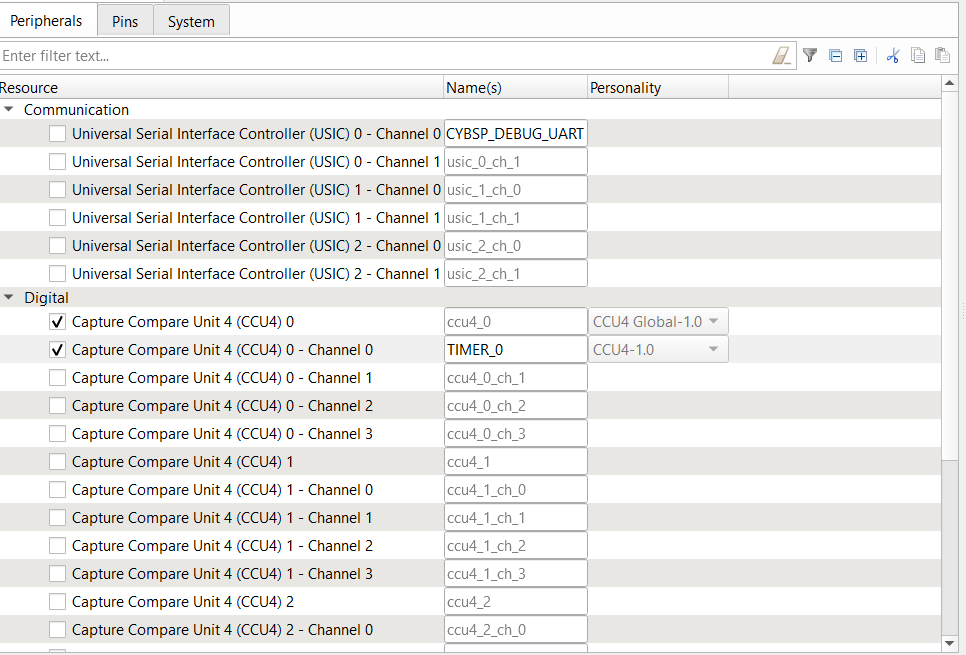

# XMC&trade; MCU: CCU4 timer

This code example demonstrates the usage of the CCU4 timer by blinking an LED using the CCU4 timer period match interrupt available in XMC&trade; MCU.

## Requirements

- [ModusToolbox&trade; software](https://www.cypress.com/products/modustoolbox-software-environment) v3.0
- [SEGGER J-Link software](https://www.segger.com/downloads/jlink/#J-LinkSoftwareAndDocumentationPack)
- Programming language: C
- Associated parts: All [XMC™ MCU](https://www.infineon.com/cms/en/product/microcontroller/32-bit-industrial-microcontroller-based-on-arm-cortex-m/) parts

## Supported toolchains (make variable 'TOOLCHAIN')

- GNU Arm® Embedded Compiler v10.3.1 (`GCC_ARM`) - Default value of `TOOLCHAIN`
- Arm&reg; compiler v6.16 (`ARM`)
- IAR C/C++ compiler v9.30.1 (`IAR`)

## Supported kits (make variable 'TARGET')

- [XMC1400 boot kit](https://www.infineon.com/cms/en/product/evaluation-boards/kit_xmc14_boot_001/)  (`KIT_XMC14_BOOT_001`) - Default value of `TARGET`
- [XMC4700 relax kit](https://www.infineon.com/cms/en/product/evaluation-boards/kit_xmc47_relax_v1/) (`KIT_XMC47_RELAX_V1`)

## Hardware setup

This example uses the board's default configuration. See the kit user guide to ensure that the board is configured correctly.

## Software setup

This example requires no additional software or tools.

## Using the code example

Create the project and open it using one of the following:

<details open><summary><b>In Eclipse IDE for ModusToolbox&trade; software</b></summary>

1. Click the **New Application** link in the **Quick Panel** (or, use **File** > **New** > **ModusToolbox&trade; Application**). This launches the [Project Creator](https://www.cypress.com/ModusToolboxProjectCreator) tool.

2. Pick a kit supported by the code example from the list shown in the **Project Creator - Choose Board Support Package (BSP)** dialog.

   When you select a supported kit, the example is reconfigured automatically to work with the kit. To work with a different supported kit later, use the [Library Manager](https://www.cypress.com/ModusToolboxLibraryManager) to choose the BSP for the supported kit. You can use the Library Manager to select or update the BSP and firmware libraries used in this application. To access the Library Manager, click the link from the **Quick Panel**.

   You can also just start the application creation process again and select a different kit.

   If you want to use the application for a kit not listed here, you may need to update the source files. If the kit does not have the required resources, the application may not work.

3. In the **Project Creator - Select Application** dialog, choose the example by enabling the checkbox.

4. (Optional) Change the suggested **New Application Name**.

5. The **Application(s) Root Path** defaults to the Eclipse workspace which is usually the desired location for the application. If you want to store the application in a different location, you can change the *Application(s) Root Path* value. Applications that share libraries should be in the same root path.

6. Click **Create** to complete the application creation process.

For more details, see the [Eclipse IDE for ModusToolbox&trade; software user guide](https://www.cypress.com/MTBEclipseIDEUserGuide) (locally available at *{ModusToolbox&trade; software install directory}/ide_{version}/docs/mt_ide_user_guide.pdf*).

</details>

<details open><summary><b>In command-line interface (CLI)</b></summary>

ModusToolbox&trade; software provides the Project Creator as both a GUI tool and the command line tool, "project-creator-cli". The CLI tool can be used to create applications from a CLI terminal or from within batch files or shell scripts. This tool is available in the *{ModusToolbox&trade; software install directory}/tools_{version}/project-creator/* directory.

Use a CLI terminal to invoke the "project-creator-cli" tool. On Windows, use the command line "modus-shell" program provided in the ModusToolbox&trade; software installation instead of a standard Windows command-line application. This shell provides access to all ModusToolbox&trade; software tools. You can access it by typing `modus-shell` in the search box in the Windows menu. In Linux and macOS, you can use any terminal application.

This tool has the following arguments:

Argument | Description | Required/optional
---------|-------------|-----------
`--board-id` | Defined in the `<id>` field of the [BSP](https://github.com/Infineon?q=bsp-manifest&type=&language=&sort=) manifest | Required
`--app-id`   | Defined in the `<id>` field of the [CE](https://github.com/Infineon?q=ce-manifest&type=&language=&sort=) manifest | Required
`--target-dir`| Specify the directory in which the application is to be created if you prefer not to use the default current working directory | Optional
`--user-app-name`| Specify the name of the application if you prefer to have a name other than the example's default name | Optional

<br>

The following example will clone the "[CCU4 Timer](https://github.com/Infineon/mtb-example-xmc-ccu4-timer)" application with the desired name "CCU4_Timer" configured for the *KIT_XMC47_RELAX_V1* BSP into the specified working directory, *C:/mtb_projects*:

   ```
   project-creator-cli --board-id KIT_XMC47_RELAX_V1 --app-id mtb-example-xmc-ccu4-timer --user-app-name CCU4_Timer --target-dir "C:/mtb_projects"
   ```

**Note:** The project-creator-cli tool uses the `git clone` and `make getlibs` commands to fetch the repository and import the required libraries. For details, see the "Project creator tools" section of the [ModusToolbox&trade; software user guide](https://www.cypress.com/ModusToolboxUserGuide) (locally available at *{ModusToolbox&trade; software install directory}/docs_{version}/mtb_user_guide.pdf*).

</details>

<details open><summary><b>In Third-party IDEs</b></summary>

**Note:** Only VS Code is supported.

1. Follow the instructions from the **In command-line interface (CLI)** section to create the application, and import the libraries using the `make getlibs` command.

2. Export the application to a supported IDE using the `make <ide>` command.

   For a list of supported IDEs and more details, see the "Exporting to IDEs" section of the [ModusToolbox&trade; software user guide](https://www.cypress.com/ModusToolboxUserGuide) (locally available at *{ModusToolbox&trade; software install directory}/docs_{version}/mtb_user_guide.pdf*).

3. Follow the instructions displayed in the terminal to create or import the application as an IDE project.

</details>

## Operation

1. Connect the board to your PC using a micro-USB cable through the debug USB connector.

2. Program the board using Eclipse IDE for ModusToolbox&trade; software:

   1. Select the application project in the Project Explorer.

   2. In the **Quick Panel**, scroll down, and click **\<Application Name> Program (JLink)**.

3. Confirm that the kit LED blinks at approximately 1 Hz.

## Debugging

You can debug the example to step through the code. In the IDE, use the **\<Application Name> Debug (JLink)** configuration in the **Quick Panel**. For more details, see the "Program and Debug" section in the [Eclipse IDE for ModusToolbox&trade; user guide](https://www.cypress.com/MTBEclipseIDEUserGuide).

## Design and implementation

In this example, a CCU4 Timer is implemented using the device configurator and the “CCU4 1.0” personality. The slice is configured in compare mode. The prescaler and period values of the slice are set in order to have a period of 1 s. To visualize the usage of the timer, a pin was configured by the “pin 1.0” personality, which is connected to the user LED.



The code consists of  the following steps:

* **Step 1:** Initializes and enables a CCU4 timer period match interrupt. It also defines the function of the interrupt handler - `TIMER_0_PERIOD_MATCH_EVENT_HANDLER()`. By calling the interrupt function, the `timer_interrupt_flag` variable is set to TRUE.

* **Step 2:** Uses the `timer_interrupt_flag` variable to detect the interrupt event and to toggle the user LED at approximately 1 Hz in the endless while-loop in the main function.


## Related resources

Resources  | Links
-----------|----------------------------------
Code examples  | [Using ModusToolbox&trade; software](https://github.com/Infineon/Code-Examples-for-ModusToolbox-Software) on GitHub
Device documentation | [XMC4000 family datasheets](https://www.infineon.com/cms/en/product/microcontroller/32-bit-industrial-microcontroller-based-on-arm-cortex-m/32-bit-xmc4000-industrial-microcontroller-arm-cortex-m4/#document-group-myInfineon-49) <br> [XMC4000 family technical reference manuals](https://www.infineon.com/cms/en/product/microcontroller/32-bit-industrial-microcontroller-based-on-arm-cortex-m/32-bit-xmc4000-industrial-microcontroller-arm-cortex-m4/#document-group-myInfineon-44)
Development kits | [XMC&trade; eval boards](https://www.infineon.com/cms/en/product/microcontroller/32-bit-industrial-microcontroller-based-on-arm-cortex-m/#boards)
Libraries on GitHub  | [mtb-xmclib-cat3](https://github.com/Infineon/mtb-xmclib-cat3) – XMC&trade; peripheral driver library (XMCLib)
Tools  | [Eclipse IDE for ModusToolbox&trade; software](https://www.infineon.com/modustoolbox) – ModusToolbox&trade; software is a collection of easy-to-use software and tools enabling rapid development with Infineon MCUs, covering applications from embedded sense and control to wireless and cloud-connected systems using AIROC&trade; Wi-Fi and Bluetooth® connectivity devices.

## Other resources

Infineon provides a wealth of data at www.infineon.com to help you select the right device, and quickly and effectively integrate it into your design.

For XMC&trade; MCU devices, see [32-bit XMC™ industrial microcontroller based on Arm® Cortex®-M](https://www.infineon.com/cms/en/product/microcontroller/32-bit-industrial-microcontroller-based-on-arm-cortex-m/).


## Document history

Document title: *CE231958* – *XMC&trade; MCU: CCU4 timer*

| Version | Description of change                         |
| ------- | --------------------------------------------- |
| 0.5.0   | New code example                              |
| 1.0.0   | Updated to support ModusToolbox software v2.3 |
| 1.0.1   | Updated README                                |
| 1.1.0   | Added support for new kits                    |
| 2.0.0   | Updated to support ModusToolbox software v3.0; CE will not be backwards compatible with previous versions of ModusToolbox™ software |
------

All other trademarks or registered trademarks referenced herein are the property of their respective owners.

© 2022 Infineon Technologies AG

All Rights Reserved.

### Legal disclaimer

The information given in this document shall in no event be regarded as a guarantee of conditions or characteristics. With respect to any examples or hints given herein, any typical values stated herein and/or any information regarding the application of the device, Infineon Technologies hereby disclaims any and all warranties and liabilities of any kind, including without limitation, warranties of non-infringement of intellectual property rights of any third party.

### Information

For further information on technology, delivery terms and conditions and prices, please contact the nearest Infineon Technologies Office (www.infineon.com).

### Warnings

Due to technical requirements, components may contain dangerous substances. For information on the types in question, please contact the nearest Infineon Technologies Office.

Infineon Technologies components may be used in life-support devices or systems only with the express written approval of Infineon Technologies, if a failure of such components can reasonably be expected to cause the failure of that life-support device or system or to affect the safety or effectiveness of that device or system. Life support devices or systems are intended to be implanted in the human body or to support and/or maintain and sustain and/or protect human life. If they fail, it is reasonable to assume that the health of the user or other persons may be endangered.

-------------------------------------------------------------------------------
